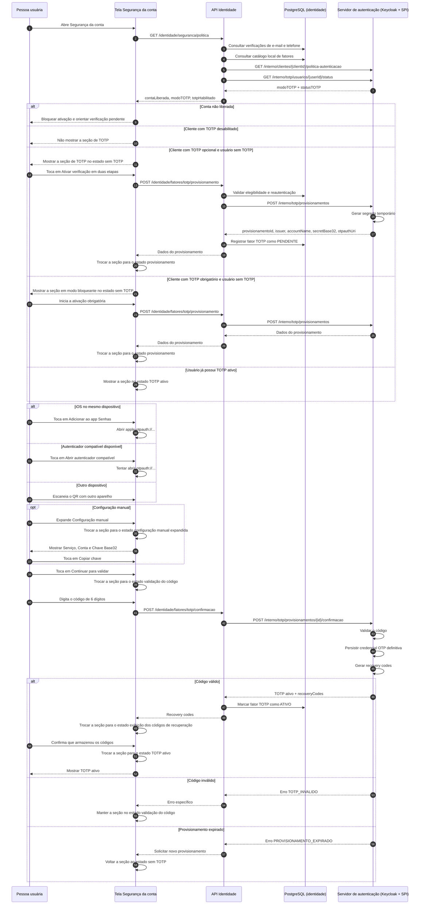
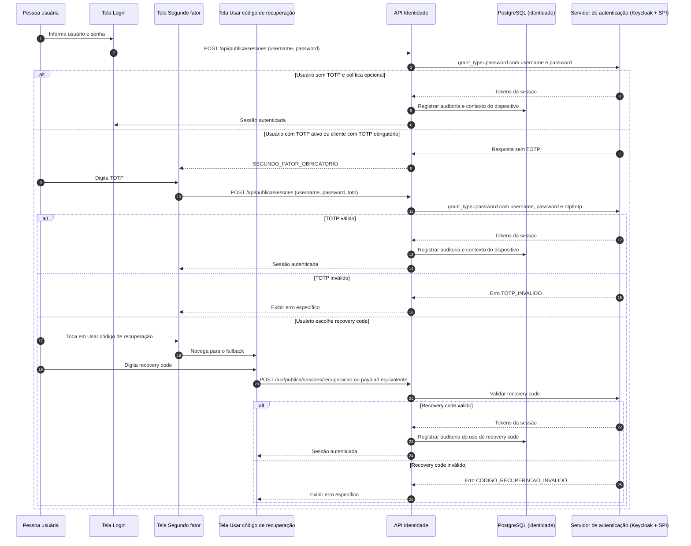
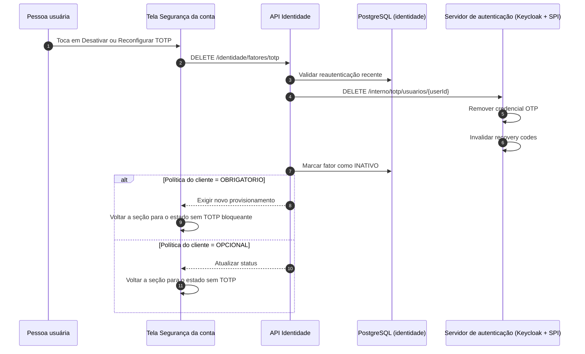
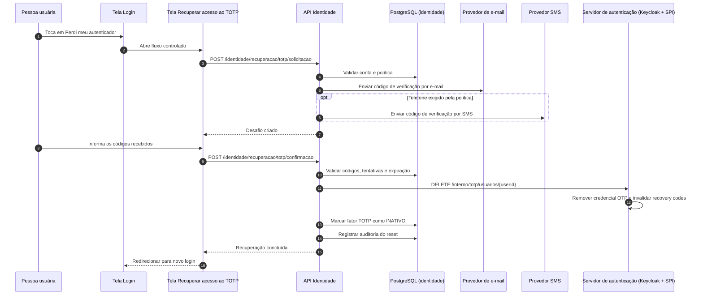

# Diagrama de sequência – TOTP no aplicativo e no Keycloak

> Status deste documento: **canônico no seu escopo**.
>
> Este documento descreve a jornada funcional e tecnica do TOTP na superficie
> publicada.
>
> Ele nao detalha ownership interno de `Pessoa`, `PerfilSistema` ou separacao
> entre servicos alem do necessario para o fluxo de segundo fator.

Este documento descreve o fluxo teórico completo do TOTP na implementação única discutida para a Eickrono.

Premissa principal de UX:

- na área autenticada, o TOTP deve viver em uma única tela: `Segurança da conta`;
- o que muda não são várias telas independentes, e sim os estados da seção de TOTP dentro dessa mesma tela;
- telas separadas só fazem sentido para os fluxos fora da área autenticada, como `Login`, `Segundo fator` e `Recuperar acesso ao TOTP`.

Todos os diagramas usam sintaxe Mermaid.

## Superfícies necessárias

### Área autenticada

- `Tela Segurança da conta`
  - estado `sem TOTP`
  - estado `provisionamento`
  - estado `configuração manual expandida`
  - estado `validação do código`
  - estado `exibição dos códigos de recuperação`
  - estado `TOTP ativo`

### Área não autenticada

- `Tela Login`
- `Tela Segundo fator`
- `Tela Usar código de recuperação`
- `Tela Recuperar acesso ao TOTP`

Observações:

- `Configuração manual` não precisa ser uma tela; ela deve ser um bloco expandível dentro de `Segurança da conta`.
- `Validação do código` pode ser uma troca de estado da mesma seção, sem sair da mesma tela.
- `Códigos de recuperação` podem aparecer como etapa final dentro da mesma tela ou em modal dedicado, mas ainda como continuação do mesmo fluxo.
- no iOS, o estado de provisionamento pode mostrar `Adicionar ao app Senhas`;
- nas demais plataformas, o contrato principal continua sendo `QR + chave manual`.

## Fluxo 1 – Área autenticada: uma única tela com estados da seção TOTP

## Fluxo 2 – Login e segunda etapa fora da área autenticada

## Fluxo 3 – Desativação ou reconfiguração dentro da mesma tela Segurança da conta

## Fluxo 4 – Recuperação controlada quando a pessoa perdeu o autenticador

## Resumo de modelagem de UX

- `Segurança da conta` é a única tela autenticada necessária para ativação e gestão do TOTP.
- dentro dela, a seção de TOTP troca de estado ao longo do fluxo.
- `Configuração manual` não é tela; é expansão.
- `Validação do código` não precisa ser tela; pode ser o próximo estado da mesma seção.
- `Códigos de recuperação` podem ser a etapa final do mesmo fluxo, sem criar uma área paralela.
- telas separadas ficam reservadas para login, segundo fator e recuperação de acesso.

## Resumo técnico do que precisa existir

- política do cliente com `DESABILITADO | OPCIONAL | OBRIGATORIO`;
- consulta autenticada de política e status para montar `Segurança da conta`;
- provisionamento TOTP com segredo temporário;
- confirmação posterior com código de 6 dígitos;
- persistência definitiva do segredo apenas no Keycloak;
- catálogo local de fatores sem replicar segredo TOTP;
- recovery codes já na primeira entrega;
- evolução de `POST /api/publica/sessoes` para aceitar `totp`;
- erros semânticos para `SEGUNDO_FATOR_OBRIGATORIO`, `TOTP_INVALIDO` e `CODIGO_RECUPERACAO_INVALIDO`;
- reset controlado quando a pessoa perder o autenticador.
