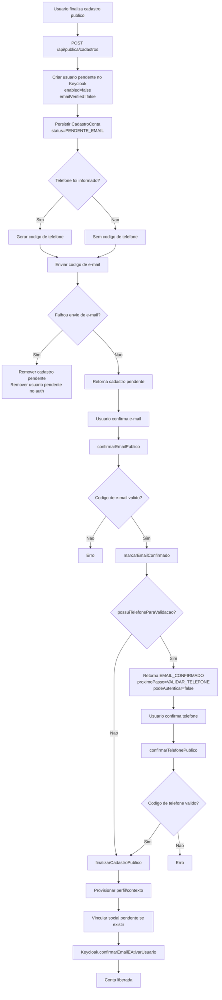
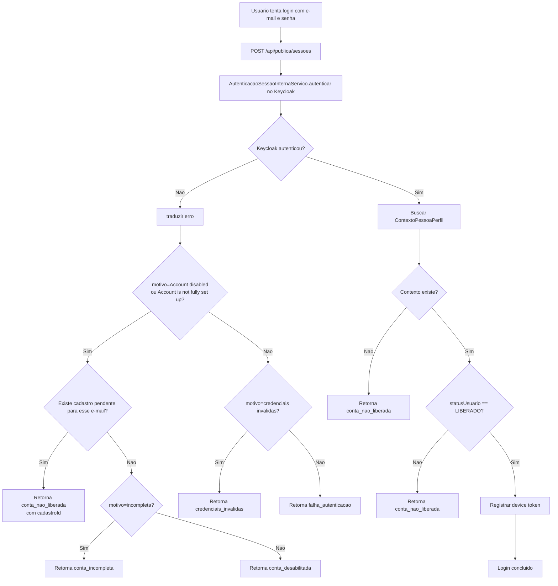
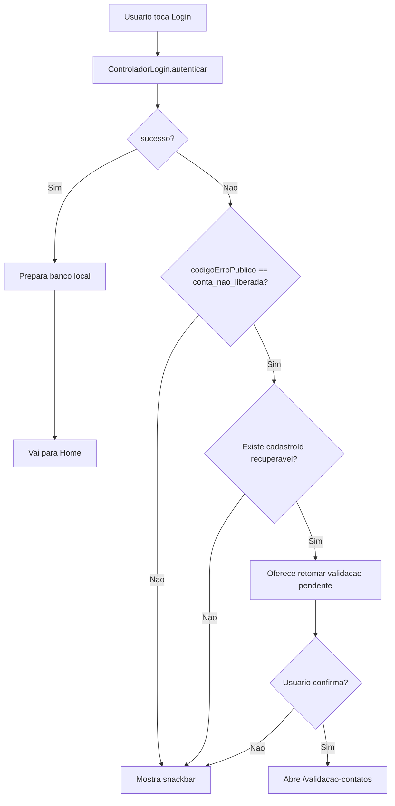
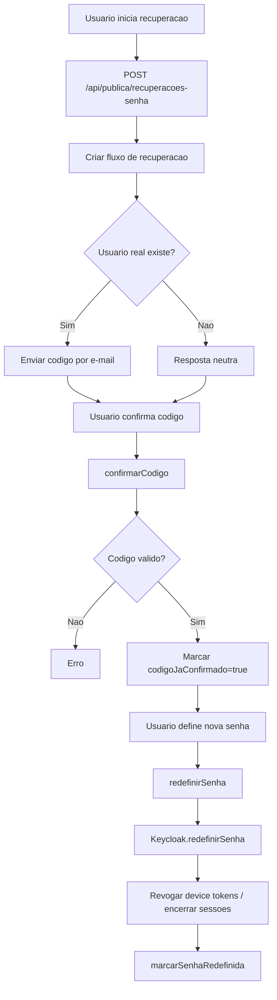
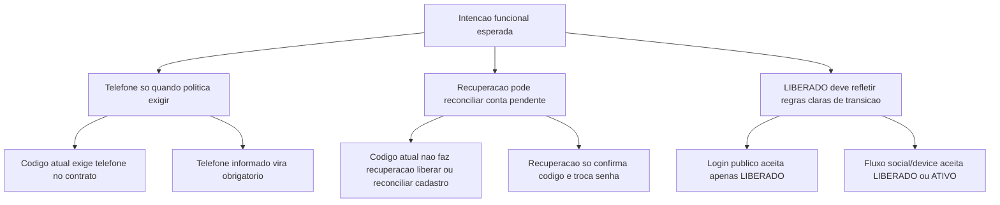

# Fluxogramas dos Fluxos Publicos - Estado Atual Implementado

Este documento registra o comportamento **atual do codigo** do ecossistema de
autenticacao, para facilitar analise funcional, comparacao com a documentacao
alvo e identificacao de divergencias.

Importante:

- este documento **nao** descreve o comportamento desejado ideal;
- ele descreve o que hoje esta implementado principalmente em:
  - `eickrono-identidade-servidor`
  - `eickrono-thimisu-app`
- quando houver conflito entre este documento e um guia arquitetural de alvo,
  deve-se assumir que aqui esta o retrato do runtime/codigo vigente.

## Escopo observado

- cadastro publico
- validacao de contatos
- login publico com e-mail e senha
- desvio do app para retomada de validacao
- recuperacao de senha

## 1. Cadastro Publico Hoje

### Leitura objetiva

- hoje, no cadastro publico, `telefone informado` vira `telefone obrigatorio`;
- isso nao nasce de uma politica de produto separada;
- isso nasce do desenho atual do contrato e do dominio:
  - o request publico exige `telefone`;
  - a confirmacao considera `telefoneObrigatorio = possuiTelefoneParaValidacao()`.

## 2. Login Publico Hoje

### Leitura objetiva

- o login publico tem dois gates:
  - autenticacao no Keycloak;
  - estado `LIBERADO` no contexto local;
- por isso uma conta pode autenticar no servidor de autorizacao e ainda assim
  ser bloqueada depois por contexto/status local.

## 3. App no Login Hoje

### Leitura objetiva

- o app hoje nao entra mais automaticamente em `/validacao-contatos`;
- ele oferece confirmacao antes de abrir a retomada;
- esse comportamento e apenas de UX;
- ele nao resolve por si so a causa raiz do estado da conta.

## 4. Recuperacao de Senha Hoje

### Leitura objetiva

- a recuperacao de senha hoje:
  - valida codigo;
  - redefine senha;
  - revoga sessoes/tokens ativos;
- ela **nao** libera conta pendente de cadastro;
- ela **nao** ativa usuario desabilitado no servidor de autorizacao;
- ela **nao** promove `statusUsuario` para `LIBERADO`.

## 5. Divergencias Objetivas Encontradas

## 6. Achados de Analise

### Telefone

- o desenho alvo em outros documentos fala `telefone quando a politica exigir`;
- o codigo atual do cadastro publico nao implementa uma politica separada;
- ele implementa esta regra pratica:
  - se o cadastro tiver telefone, o telefone entra como canal obrigatorio.

### Recuperacao de senha

- o codigo atual trata recuperacao como fluxo separado de cadastro pendente;
- nao existe hoje reconciliacao explicita entre:
  - conta pendente/incompleta;
  - validacao de codigo de recuperacao;
  - liberacao final da conta.

### Estado do usuario

- o significado de `LIBERADO` e `ATIVO` ainda nao esta uniforme em todos os
  fluxos;
- no login publico por senha, a verificacao final exige `LIBERADO`;
- em parte do fluxo social/dispositivo, `ATIVO` tambem pode ser aceito.

## 7. Uso Recomendado Deste Documento

Este documento deve ser usado como base para:

- revisar o que o runtime faz hoje;
- comparar `estado atual` x `estado alvo`;
- desenhar a maquina de estados canonica antes de corrigir comportamento;
- evitar novas correcoes locais de UX sem antes fechar a regra de negocio.
