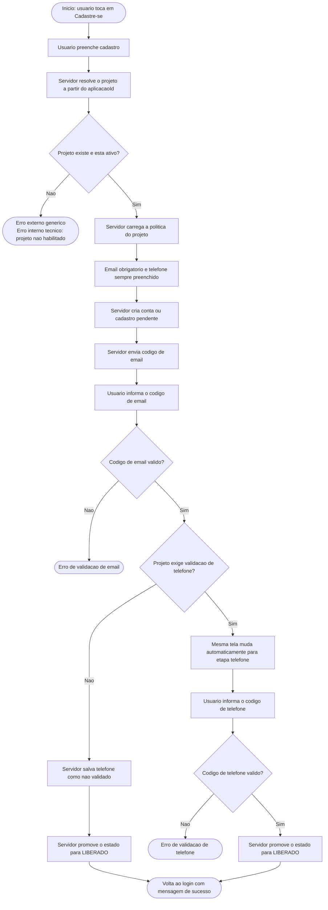
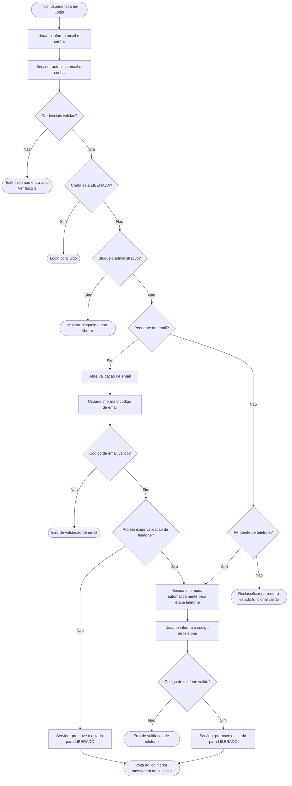
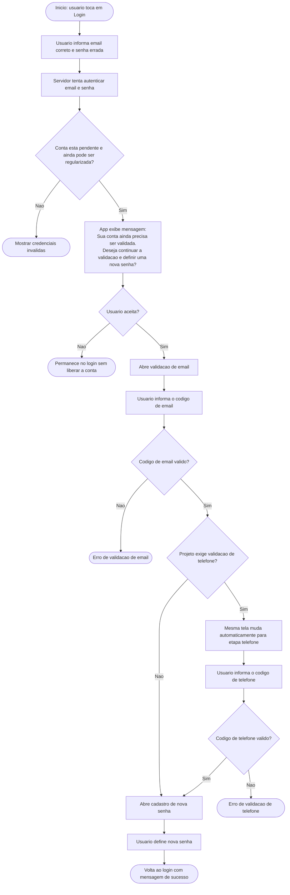
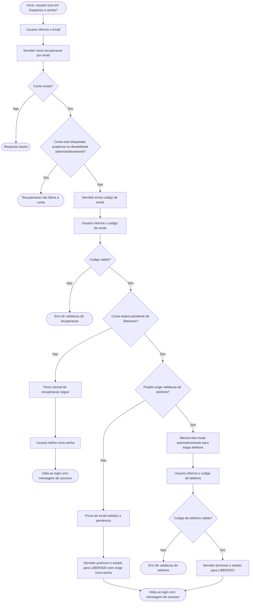
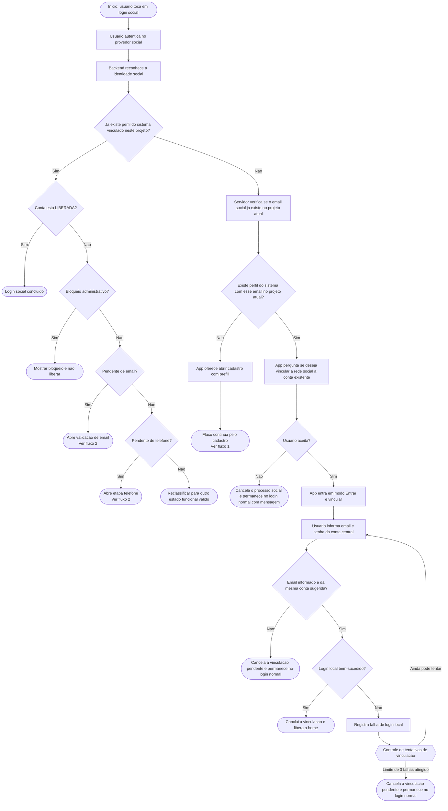

# Fluxograma Funcional dos Fluxos Publicos - Regra em Fechamento

Este documento consolida a **regra funcional em fechamento** para os fluxos
publicos do ecossistema de autenticacao.

Diferenca para os outros documentos:

- `fluxogramas_fluxos_publicos_estado_atual.md` descreve o que o codigo faz
  hoje;
- este documento descreve o **fluxo funcional desejado** de acordo com as
  decisoes ja aprovadas na conversa.

Importante:

- este documento **nao altera o codigo**;
- ele serve para comparar `estado atual` x `regra funcional desejada`;
- ele representa o alvo funcional fechado ate aqui, servindo de base para TDD
  e implementacao;
- os `CASO-01` a `CASO-20` abaixo ja foram mapeados em TDD explicito na matriz
  do app, no bloco `TDD-45` a `TDD-64`.
- o detalhamento tecnico de ownership por camada e de dependencia de
  `migration/catalogo` fica em
  [mapeamento_tdd_componentes_migracoes_fluxos_publicos.md](mapeamento_tdd_componentes_migracoes_fluxos_publicos.md).
- a especificacao exata de schema dos pacotes `DB-01`, `DB-02` e `DB-03`
  fica em
  [especificacao_schema_db01_db02_db03_fluxos_publicos.md](especificacao_schema_db01_db02_db03_fluxos_publicos.md).

## Regras ja fechadas nesta conversa

- o servidor de autenticacao atende multiplos projetos do ecossistema;
- o `aplicacaoId` de entrada e a chave canonica do fluxo publico;
- a politica do projeto deve ser resolvida a partir de um identificador ja
  existente de cliente/ecossistema;
- a tabela catalogo de projetos/clientes deve ter ao menos:
  - identificador ja existente de cliente/ecossistema;
  - `nomeProjeto`;
  - `tipoProdutoExibicao`;
  - `produtoExibicao`;
  - `canalExibicao`;
  - `exigeValidacaoTelefone`;
  - `ativo`;
- `email` e obrigatorio;
- `telefone` sempre deve ser preenchido;
- `telefone preenchido` **nao** implica validacao obrigatoria;
- a obrigatoriedade da validacao do telefone depende do projeto;
- a validacao de contatos comeca sempre por `email`;
- se o projeto nao exigir validacao de telefone, confirmar o email ja pode
  liberar a conta e o telefone fica salvo como `nao validado`;
- se o projeto exigir validacao de telefone, depois do email a mesma tela
  segue automaticamente para a etapa de telefone;
- a recuperacao de senha pode servir como prova de posse do email para conta
  pendente, desde que a conta nao esteja bloqueada, suspensa ou desabilitada
  por regra administrativa;
- quando a conta pendente for regularizada por validacao, o fluxo volta ao
  login com mensagem de sucesso;
- quando o usuario tentar login com conta pendente regularizavel e senha
  incorreta, o app deve oferecer a mensagem:
  - `Sua conta ainda precisa ser validada. Deseja continuar a validacao e definir uma nova senha?`;
- se o usuario aceitar essa mensagem, o fluxo segue para:
  - validacao de email;
  - validacao de telefone, se o projeto exigir;
  - definicao de nova senha;
  - retorno ao login com mensagem de sucesso;
- no login social sem perfil do sistema ja vinculado, o servidor deve verificar
  se o email social ja existe no projeto atual;
- se esse email ja existir no projeto atual, o app deve oferecer vinculacao com
  conta existente, em vez de abrir cadastro novo diretamente;
- se o usuario aceitar a vinculacao:
  - o app entra em modo `Entrar e vincular`;
  - a vinculacao so conclui depois de login local bem-sucedido com a conta
    correta;
  - se o usuario errar a senha 3 vezes ou tentar autenticar com outra conta,
    o processo de vinculacao e cancelado;
- se o email existir apenas em outro projeto, isso nao influencia o fluxo do
  projeto atual;
- `ATIVO` significa conta existente/ativa;
- `LIBERADO` significa pronta para login no fluxo/projeto;
- `EM_PREPARACAO` nao faz parte do produto alvo;
- projeto desconhecido deve gerar mensagem externa controlada e erro tecnico
  interno especifico.

## Fluxogramas funcionais por ponto de entrada

Os fluxos abaixo seguem uma convenção mais estrita:

- cada diagrama tem um **ponto de entrada explicito**;
- cada decisao relevante aparece como **pergunta binaria**;
- quando ha mais de dois resultados possiveis, eles sao quebrados em varias
  decisoes sequenciais;
- as regras especiais ficam destacadas apenas no trecho em que surgem.

### 1. Inicio pelo botao `Cadastre-se`

### 2. Inicio pelo botao `Login` com credenciais validas

### 3. Inicio pelo botao `Login` com conta pendente e senha errada

### 4. Inicio pelo botao `Esqueceu a senha?`

### 5. Inicio pelo botao de `Login social`

## Casos tecnicos derivados para implementacao

Os casos abaixo sao a fonte funcional canonica para implementacao.

Rastreabilidade de testes:

- cada `CASO-*` abaixo possui TDD explicito correspondente em
  `../../../eickrono-thimisu/eickrono-thimisu-app/docs/matriz_autenticacao_social_conectividade_testes.md`;
- o mapeamento atual vai de `TDD-45` a `TDD-64`.

### Cadastro publico

- `CASO-01` Cadastro em projeto ativo com `exigeValidacaoTelefone=false`
  - entrada: `aplicacaoId` valido, email informado, telefone preenchido
  - comportamento:
    - criar cadastro pendente
    - enviar codigo de email
    - confirmar email
    - salvar telefone como nao validado
    - promover a conta para `LIBERADO`
    - voltar ao login com mensagem de sucesso
- `CASO-02` Cadastro em projeto ativo com `exigeValidacaoTelefone=true`
  - entrada: `aplicacaoId` valido, email informado, telefone preenchido
  - comportamento:
    - criar cadastro pendente
    - enviar codigo de email
    - confirmar email
    - manter a mesma tela e abrir automaticamente a etapa de telefone
    - confirmar telefone
    - promover a conta para `LIBERADO`
    - voltar ao login com mensagem de sucesso
- `CASO-03` Projeto desconhecido ou inativo
  - entrada: `aplicacaoId` ausente, desconhecido ou desabilitado
  - comportamento:
    - abortar o fluxo
    - expor erro tecnico interno especifico para operacao/suporte
    - mostrar apenas mensagem externa controlada ao operador final

### Login tradicional

- `CASO-04` Login com credenciais corretas e conta ja `LIBERADA`
  - comportamento:
    - autenticar
    - concluir login imediatamente
- `CASO-05` Login com credenciais corretas e conta pendente apenas de email
  - comportamento:
    - abrir validacao de email
    - se o projeto nao exigir telefone, liberar
    - se o projeto exigir telefone, seguir automaticamente para telefone
- `CASO-06` Login com credenciais corretas e conta pendente de telefone
  - comportamento:
    - abrir diretamente a mesma tela na etapa de telefone
    - liberar apenas apos a confirmacao do telefone
- `CASO-07` Login com conta bloqueada, suspensa ou desabilitada
  - comportamento:
    - nao iniciar regularizacao automatica
    - nao abrir validacao de contato
    - manter bloqueio com mensagem funcional apropriada
- `CASO-08` Login com conta pendente regularizavel e senha incorreta
  - comportamento:
    - mostrar a mensagem:
      - `Sua conta ainda precisa ser validada. Deseja continuar a validacao e definir uma nova senha?`
    - se o usuario recusar:
      - permanecer no login sem liberar a conta
    - se o usuario aceitar:
      - validar email
      - validar telefone, se o projeto exigir
      - abrir cadastro de nova senha
      - retornar ao login com mensagem de sucesso
- `CASO-09` Login com email inexistente ou conta nao regularizavel
  - comportamento:
    - nao abrir fluxo de regularizacao
    - responder como falha de credencial ou erro controlado equivalente

### Recuperacao de senha

- `CASO-10` Recuperacao de senha de conta ja liberada
  - comportamento:
    - enviar codigo de email
    - validar codigo
    - permitir definicao de nova senha
    - voltar ao login com mensagem de sucesso
- `CASO-11` Recuperacao de senha de conta pendente com `exigeValidacaoTelefone=false`
  - comportamento:
    - tratar o codigo de recuperacao como prova de posse do email
    - nao exigir redefinicao de senha se a senha anterior ainda puder ser mantida
    - promover a conta para `LIBERADO`
    - voltar ao login com mensagem de sucesso
- `CASO-12` Recuperacao de senha de conta pendente com `exigeValidacaoTelefone=true`
  - comportamento:
    - tratar o codigo de recuperacao como prova de posse do email
    - seguir automaticamente para a etapa de telefone
    - apos validar telefone, promover a conta para `LIBERADO`
    - se a regularizacao exigir nova senha, concluir a definicao da senha antes de voltar ao login
- `CASO-13` Recuperacao de conta bloqueada, suspensa ou desabilitada administrativamente
  - comportamento:
    - nao usar a recuperacao para liberar a conta
    - manter o bloqueio funcional

### Login social

- `CASO-14` Login social com perfil do sistema ja vinculado e `LIBERADA`
  - comportamento:
    - concluir login social
    - liberar a home
- `CASO-15` Login social sem perfil do sistema vinculado e sem email igual no projeto atual
  - comportamento:
    - manter contexto social pendente
    - oferecer abertura de cadastro com prefill editavel
    - nao considerar registros do mesmo email em outros projetos
- `CASO-16` Login social sem perfil do sistema vinculado, mas com email ja existente no projeto atual
  - comportamento:
    - oferecer vinculacao com conta existente
    - nao abrir cadastro novo diretamente
- `CASO-17` Usuario recusa a vinculacao social sugerida
  - comportamento:
    - cancelar o contexto social pendente
    - permanecer no login normal com mensagem
- `CASO-18` Usuario aceita a vinculacao e autentica a mesma conta sugerida com sucesso
  - comportamento:
    - concluir a vinculacao social
    - liberar a home
- `CASO-19` Usuario aceita a vinculacao, mas tenta autenticar outra conta
  - comportamento:
    - cancelar imediatamente a vinculacao pendente
    - permanecer no login normal
- `CASO-20` Usuario aceita a vinculacao, insiste na mesma conta, mas falha 3 vezes
  - comportamento:
    - permitir ate 3 tentativas na mesma conta sugerida
    - ao atingir o limite, cancelar a vinculacao pendente
    - permanecer no login normal

## Estado removido do alvo: Q7
O estado `EM_PREPARACAO` nao faz parte do produto alvo.

Consequencia funcional:

- qualquer ramo que hoje use `EM_PREPARACAO` no runtime precisa ser
  reclassificado para um estado funcional canonico, por exemplo:
  - pendente de email;
  - pendente de telefone;
  - bloqueio administrativo;
  - conta social sem perfil do sistema no projeto;
  - conta desabilitada.

## Fechamento complementar do login social sem perfil do sistema vinculado

Quando a autenticacao social for bem-sucedida, mas ainda nao existir conta
ou perfil do sistema ja vinculado no projeto atual:

- o servidor deve verificar se o email da autenticacao social ja existe no
  projeto atual;
- se nao existir no projeto atual:
  - o app pode seguir para oferta de cadastro novo com prefill;
- se existir no projeto atual:
  - o app deve oferecer vinculacao com perfil existente do projeto;
  - se o usuario recusar:
    - o fluxo social pendente e descartado;
    - o app permanece no login normal com mensagem;
  - se o usuario aceitar:
    - o app entra em modo `Entrar e vincular`;
    - a vinculacao so termina se o usuario autenticar a conta central correta
      com sucesso;
    - se tentar outra conta ou errar a senha 3 vezes:
      - o processo de vinculacao e cancelado;
      - o app permanece no login normal.

Restricao importante:

- o fato de o email existir em outro projeto nao interfere no projeto atual.

## Fechamento de Q9

O caso de `Q9` e este:

1. o usuario iniciou cadastro e definiu senha;
2. a conta ainda nao ficou liberada porque faltou validar email ou telefone;
3. dias depois ele volta pela tela de `Login`;
4. informa o email correto;
5. mas digita a senha errada.

Regra funcional fechada:

- o app deve perguntar:
  - `Sua conta ainda precisa ser validada. Deseja continuar a validacao e definir uma nova senha?`
- se o usuario recusar:
  - permanece no login, sem liberar a conta;
- se o usuario aceitar:
  - valida email;
  - valida telefone, se o projeto exigir;
  - abre a definicao de nova senha;
  - retorna ao login com mensagem de sucesso.

## Diferencas principais para o runtime atual

Este documento assume uma regra funcional diferente do runtime atual em pontos
importantes:

- a obrigatoriedade da validacao do telefone vem da politica do projeto, nao
  da mera existencia do telefone;
- a recuperacao de senha pode reconciliar conta pendente em certos estados;
- `ATIVO` e `LIBERADO` tem papeis distintos e precisam ser tratados de maneira
  consistente;
- `EM_PREPARACAO` deixa de existir no produto alvo;
- o login social passa a verificar explicitamente se o email social ja existe
  no projeto atual antes de oferecer cadastro novo;
- a vinculacao social assistida passa a ter cancelamento por:
  - outra conta informada;
  - limite de 3 falhas na conta sugerida;
- projeto desconhecido vira erro tecnico interno especifico com mensagem
  externa controlada.

## Pendencias remanescentes antes de rollout

Mesmo com o fluxo funcional e os testes locais alinhados, ainda restam
pendencias tecnicas que devem ser fechadas antes de promover essas alteracoes
para ambientes compartilhados:

- o catalogo de projetos ainda nao pode ser endurecido por completo com
  `NOT NULL` nos campos de exibicao:
  - as migrations versionadas seedam explicitamente apenas
    `eickrono-thimisu-app`;
  - qualquer outro projeto ativo do catalogo alem de
    `eickrono-thimisu-app`, quando presente no ambiente, ainda depende de
    seed complementar para preencher `tipo_produto_exibicao`,
    `produto_exibicao` e `canal_exibicao`;
  - sem esse preenchimento, a migration final de endurecimento do catalogo
    deve continuar bloqueada;
- o app ainda persiste o cadastro pendente de forma rasa:
  - o armazenamento local continua centrado em `cadastroId`;
  - limpeza, retomada e reconciliacao fora da mesma jornada continuam mais
    frageis do que o ideal;
- o rollout para `hml` deve continuar bloqueado ate:
  - a documentacao do app refletir o runtime atual sem contradicoes;
  - o catalogo de projetos local e de homologacao estar preenchido;
  - os contratos e seeds necessarios por projeto estarem estabilizados.

## Uso recomendado deste documento

Usar este documento para:

- revisar o fluxo funcional alvo antes de alterar codigo;
- comparar `estado atual` x `estado desejado`;
- usar os `CASO-01` a `CASO-20` como entrada canonica para TDD;
- usar o bloco `TDD-45` a `TDD-64` da matriz do app como rastreabilidade
  executavel minima antes de alterar runtime;
- transformar depois esse desenho em backlog de implementacao.
